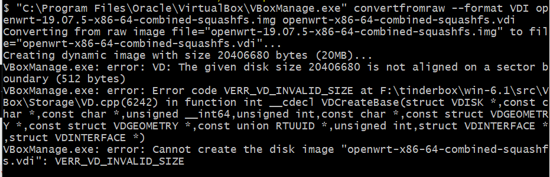
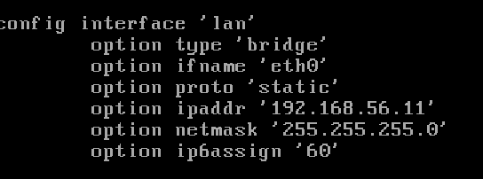
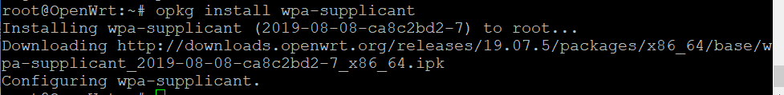
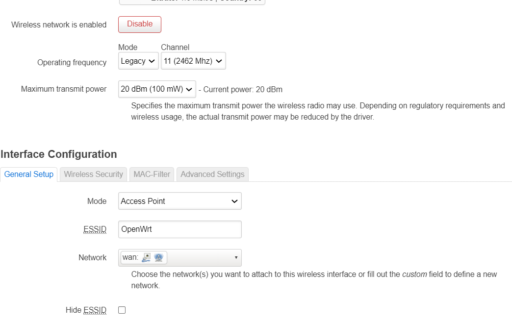
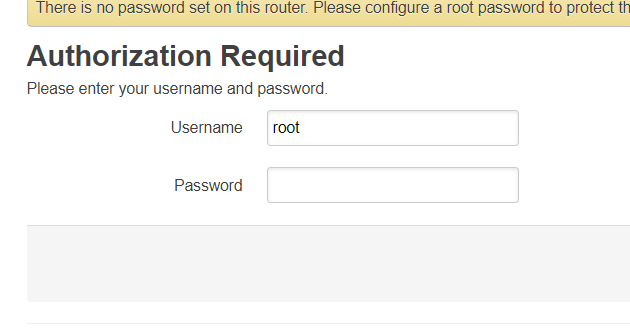

# 实验一：OpenWrt 虚拟机搭建
## 实验目的：
- 熟悉基于OpenWrt的无线接入点（AP）配置
- 为第二章，第三章和第四章实验准备好“无线软AP”环境
## 实验环境
- 可以开启监听模式、AP 模式和数据帧注入功能的 USB 无线网卡
- Virtualbox
## 实验要求
- 对照第一章实验无线路由器/无线接入点（AP）配置列的功能清单，找到在OpenWrt中的配置界面并截图证明；
- 记录环境建设步骤；
- 如果USB无线网卡能在OpenWrt中正常工作，则截图证明；
- 如果USB无线网卡不能在OpenWrt中正常工作，截图并分析可能的故障原因并导致可能的解决方法。

## 实验步骤
### 安装OpenWrt
- 下载wget

####1 下载镜像文件
wget https://downloads.openwrt.org/releases/19.07.5/targets/x86/64/openwrt-19.07.5-x86-64-combined-squashfs.img.gz

#### 2 解压缩
gunzip openwrt-x86-64-combined-squashfs.img.gz

#### 3 img 格式转换为 vdi格式
dd if=openwrt-19.07.5-x86-64-combined-squashfs.img of=openwrt-x86-64-combined-squashfs-padded.img bs=128000 conv=sync

"C:\Program Files\Oracle\VirtualBox\VBoxManage.exe" convertfromraw --format VDI openwrt-x86-64-combined-squashfs-padded.img openwrt-x86-64-combined-squashfs.vdi
#### 4 新建虚拟机选择 Linux / Linux 2.6 / 3.x / 4.x 并将内存设置为256mb

#### 5 利用虚拟硬盘文件注册新虚拟硬盘文件选择刚才转换生成的 .vdi 文件得到新的虚拟机openwrt



- 磁盘的扩容
```
"C:\Program Files\Oracle\VirtualBox\VBoxManage.exe" modifymedium disk --resize 10240 openwrt-x86-64-combined-squashfs.vdi
```
- 根据已有的vdi创建openwrt虚拟机，并设置网卡
> - 第一块网卡设置为：Intel PRO/1000 MT 桌面（仅主机(Host-Only)网络）
> - 第二块网卡设置为：Intel PRO/1000 MT 桌面（网络地址转换(NAT)）

- ```vi```命令直接编辑```/etc/config/network```配置文件修改网卡地址

- 通过```ifdown lan && ifup lan```配置生效
- Luci安装


### AP开启
```

  USB 外设的标识信息
lsusb

  USB 外设的驱动加载情况
lsusb -t

通过 opkg find 命令可以快速查找可能包含指定芯片名称的驱动程序包
opkg find kmod-* | grep 2870
```

- 
> - 无线网络的详细配置界面里中 Network 必须选 wan ；
> -  WAN 网卡对应的虚拟网络类型需为 NAT。
> - 不使用 Auto 模式。

```Enable``` 启用当前无线网。


- AP的管理员用户名和密码设置

- 设置SSID
- 加密方式

- AP管理密码设置
- 配置DHCP
- 开启日志记录功能
- 配置AP隔离
- 设置MAC地址过滤的规则
- 查看WPS功能的支持情况
- 查看AP/无线路由器支持的工作模式


## 参考资料
[黄大](https://c4pr1c3.github.io/cuc-mis/chap0x01/exp.html)

