# Android 缺陷应用漏洞攻击实验 #
## 实验目的 ##
- 理解 Android 经典的组件安全和数据安全相关代码缺陷原理和漏洞利用方法；
- 掌握 Android 模拟器运行环境搭建和 ADB 使用；

## 实验环境 ##
- [Android-InsecureBankv2](https://github.com/c4pr1c3/Android-InsecureBankv2)

## 实验要求 ##
- 详细记录实验环境搭建过程；
- 至少完成以下 实验 ：
 - Developer Backdoor
 - Insecure Logging
 - Android Application patching + Weak Auth
 - Exploiting Android Broadcast Receivers
 - Exploiting Android Content Provider

## 实验过程 ##
### 实验环境 ###
- 下载并安装Android Studio
- 下载并安装Android SDK
  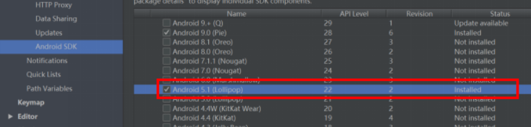
- SDK Manager 的 SDK Platforms 选项卡选择不同版本的 SDK 下载安装（安装 Intel x86 Emulator Accelerator (HAXM installer)，并且配合使用 ABI 类型为 x86/x86_64 的模拟器）
  
  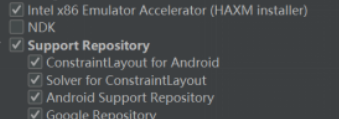
- 在AVD Manager标签下安装相应镜像后可以运行虚拟机
  
  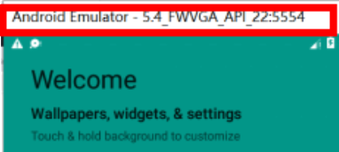
- ADB使用
  - Android 调试桥 (adb) 是一种功能多样的命令行工具，可让用户与设备进行通信。它是一种客户端-服务器程序，包括以下三个组件：
    - 客户端：用于发送命令。客户端在开发计算机上运行。可以通过发出 adb 命令从命令行终端调用客户端。
    - 守护进程 (adbd)：在设备上运行命令。守护进程在每个设备上作为后台进程运行。
    - 服务器：管理客户端和守护进程之间的通信。服务器在开发计算机上作为后台进程运行。 
  - 使用adb连接虚拟机   
    - 开启模拟器的开发者模式：在模拟器中找到设置，点击版本号“Build Number”    
    
    - 点击进入"开发者选项"，选择"允许USB调试"，连接USB后启用调试模式。   
    
   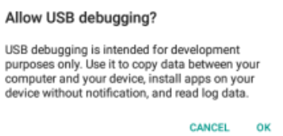 

### 渗透实验过程 ###
### 1.Developer Backdoor ###
- 克隆Android-InsecureBankv2到本地
- 下载JADX反编译器：https://github.com/skylot/jadx   
- 下载dex2jar：https://bitbucket.org/pxb1988/dex2jar/downloads
- 使用命令解压原来下载的Insecure Bankv2.apk文件的内容：unzip InsecureBankv2.apk        
  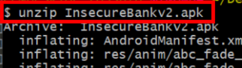       
  得到classes.dex文件   
   
- 将classes.dex文件复制到dex2jar文件夹中。通过运行以下命令使d2jdex2jar.sh和d2jinvoke.sh文件可执行：       
  - chmod +x d2j-dex2jar.sh 
  - chmod +x d2j_invoke.sh 
  
  
- 将dex文件转换为jar文件：d2j-dex2jar.bat classes.dex
  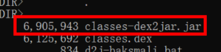 
- 打开JADX-GUI反编译器中生成的classes-dex2jar.jar文件：  
  
- Android-InsecureBankv2应用程序中存在的开发人员后门的反编译代码，该程序允许用户名为devadmin的用户与所有其他用户相比使用不同的终结点。
  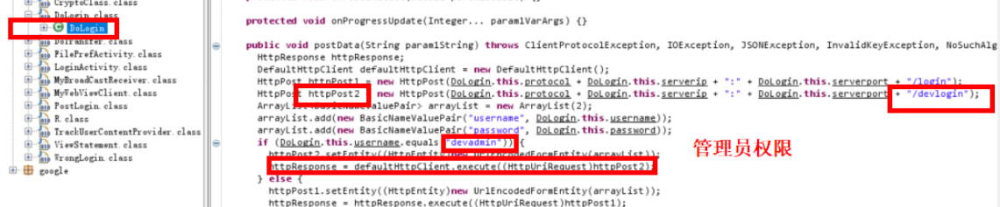  
- 发现任何用户都可以使用用户名devadmin搭配任何密码登录应用程序，而不管密码的有效性。

### 2.Insecure Logging ###
- 首先要确保AndroLab server后端已经运行   
  - 服务器组件在Insecure Bankv2项目源文件夹中的AndroLabServer文件夹中找到   
  - 安装库：pip install -r requirements.txt     
  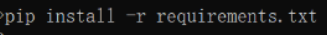
  - 在8888端口上运行HTTP服务器
- 将InsecureBankv2.apk文件复制到Android SDK中的“platform-tools”文件夹，然后将下载的Android-InsecureBankv2应用程序推送到模拟器：./adb install InsecureBankv2.apk     
  
- 在模拟器上启动已安装的InsecureBankv2应用程序         
  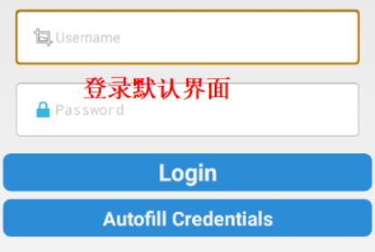
- 以用户名为dinesh，密码Dinesh@123$，进行登录  
  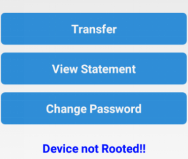
- 用lagcat查看日志可以看到登录的用户名和密码信息             
         
- 导航到 “Change Password”页面并输入新密码。    
   
      
- 用lagcat查看日志可以看到修改密码的信息          
   

### 3.Android Application patching + Weak Auth ###
- 下载apktool: http://ibotpeaches.github.io/Apktool/      
  下载SignApk: https://github.com/appium/sign
- 将InsecureBankv2.apk复制到“apktool”文件夹中，并反编译应用程序:apktool.bat d InsecureBankv2.apk,反编译应用程序后得到文件夹InsecureBankv2      
  
- 进入到该文件夹InsecureBankv2，进入res/values，并打开文件strings.xml进行编辑。将“is_admin”的值从“no”修改为“yes”        
  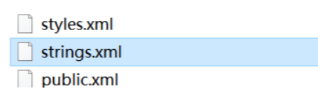     
   
- 导航回基本apktool文件夹并重新编译应用程序：apktool.bat b InsecureBankv2     
   
- 将生成的InsecureBankv2.apk文件复制到SignApk的“Dist”文件夹中，然后对在上一次测试中生成的apk文件进行签名:java -jar sign.jar InsecureBankv2.apk,生成一个名为InsecureBankv2.s.apk的新apk文件
  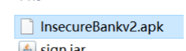      
  
  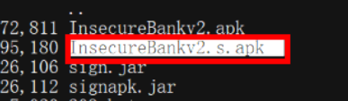
- 将新生成的InsecureBankv2.s.apk文件复制到Android SDK中的“platform-tools”文件夹中，然后将新签名的InsecureBankv2应用程序推送到仿真器:adb install InsecureBankv2.s.apk  
  
  
- 在Android模拟器中启动新安装的Insecure Bankv2应用程序。显示中用户提供了一个附加的“Create User”按钮，此按钮仅用于管理员用户，对于普通用户以前不可见，这样一来，普通用户相当于获取了管理员的权限
  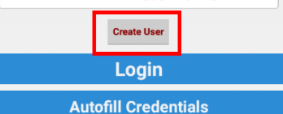

### 4.Exploiting Android Broadcast Receivers ###
- 将最初的InsecureBankv2.apk文件复制到Android SDK中的“ platform-tools”文件夹，然后将下载的Android-InsecureBankv2应用程序推送到模拟器：./adb install InsecureBankv2.apk（先卸载之前由InsecureBankv2.s.apk安装的应用程序）         
  
- 在模拟器上启动已安装的InsecureBankv2应用程序。下面的屏幕截图显示了登录后普通用户可用的默认屏幕     
  （无“create user”按钮）        
  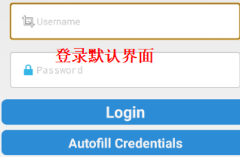
-（和上一个实验的步骤相同）将InsecureBankv2.apk复制到“apktool”文件夹中，并反编译应用程序：apktool.bat d InsecureBankv2.apk   
        
- 反编译应用程序后得到文件夹InsecureBankv2,打开解密的AndroidManifest.xml文件  ,显示应用程序中声明的Broadcast Receivers 
  
- 以下几步在第一个实验中已完成:
  - 使用以下命令解压原来下载的InsecureBankv2.apk文件的内容：unzip InsecureBankv2.apk
  - 将classes.dex文件复制到dex2jar文件夹中。通过运行以下命令使d2jdex2jar.sh和d2jinvoke.sh文件可执行 
    - chmod +x d2j-dex2jar.sh
    - chmod +x d2j_invoke.sh
  - 将dex文件转换为jar文件d2j-dex2jar.bat classes.dex 
  - 打开JADX-GUI反编译器中生成的classes-dex2jar.jar文件 
- 在模拟器上运行该应用程序，定位到“platform-tools”文件夹并输入：adb shell
- 在shell中输入以下命令：  
  ```am broadcast -a theBroadcast -n com.android.insecurebankv2/com.android.insecurebankv2.MyBroadCastReceiver --es phonenumber 5554 –es newpass Dinesh@123!```
- 以用户名为dinesh，密码Dinesh@123$，进行登录
- 发现手机发送了之前所有的密码更改记录短信  
- 修改密码为Dinesh@123！，之前输入的命令自动调用所述Broadcast，并发送带有所述密码的SMS短信，实时发送了这次修改内容      
  

### 5.Exploiting Android Content Provider ###
- 前3个步骤和上一个实验Exploiting Android Broadcast Receivers相同
- 此时打开解密的AndroidManifest.xml文件，显示应用程序中声明的TrackUserContentProvider  
     
- 第4步同上一个实验
- 打开JADX-GUI反编译器中生成的classes-dex2jar.jar文件，显示传递给先前显示的应用程序中声明的 TrackUserContentProvider 的参数    
  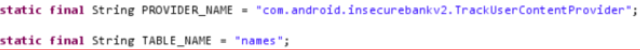   
- 第6步、第7步同上一个实验
- 在模拟器登录到应用程序
  - 首先作为用户“dinesh”，密码Dinesh@123$  ，登陆两次       
  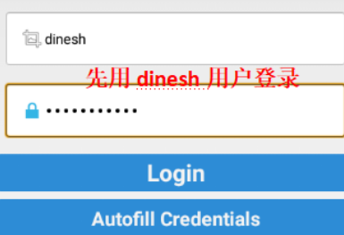     
  - 然后作为用户“jack”，密码Jack@123$ ，登陆一次      
  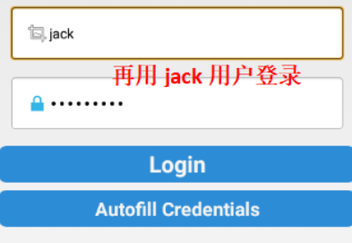    
- 在shell中输入：  
  ```content query --uri content://com.android.insecurebankv2.TrackUserContentProvider/trackerusers```     
       
  发现所有用户的登录历史都是以未加密的方式存储在设备上的，得到用户名后，可进行其它的攻击

## 参考文献 ##
- [安卓调试桥adb](https://blog.csdn.net/hedong_77/article/details/54376447)
- [Android Studio下载](https://developer.android.com/studio/)
- [实验教程](https://github.com/c4pr1c3/Android-InsecureBankv2)
- [apktool安装指南](http://ibotpeaches.github.io/Apktool/install/)
- [反编译应用程序](https://blog.csdn.net/renwudao24/article/details/79032889)